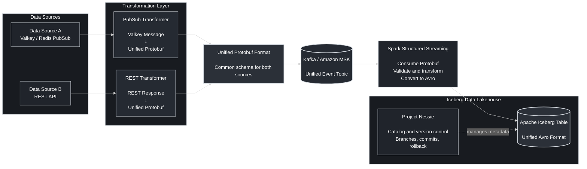

 ### Why use kafka
Given below senario, why use a kafka rather than direct write to iceberg table?

1. Before answer the question, we should ask another question why use pubsub not kafka?
  - Kafka persists and replay records and track consumer progress, it is fault tolerance but slow. The pubsub transformer consumes data from a system could tolerate data loss fault but not latency. That is the reason we choosed pubsub over kafka. 
  - Now you know producer (pubsub) fast, consumer (spark) slow. We need kafka abosrb the throughput mismtach. Iceberg write is so heavy due to stateful spark operations such as snapshots commits, manifest file management, s3 multiuploads etc. Direct write will definitely slow down the ingestion progress. A big chance producer will shutdown their produce process due to your slow ingestion job.
2. Fan-in for multiple sources, both source publishes to the same format. Or you will need to create 2 separate iceberg writer.
3. Replay and reprocessing. 

### Debug a lag issue
1. First I would check if the lag belongs to which level. If it is not a partition level, the producer rate is 150000 msg/esc and consumer rate is 100000 msg/sec. Then I would start with the following cases:
  - caseA: If consumer reaches 95% CPU usage, start with increase consumer CPU before adding any partitions.
  - caseB: If consumer count < partition count, add consumers. 
  - caseC: If consumer count == partition count, optimize or scale up consumer vertically, then add partitions.
  - caseD: If CPU low but processing is slow. go check downstream system, batch db writes, increase concurrency, use async I/O etc.
2. Then if the lag comes from specific partition, such as other partition rate is 100000 msg/sec, but one partition is 5000 msg/sec. Might be a partition key skew issue. You need to redesign your partition key.
For example, in an airsearch system we use hash(search request) as the key and each message is one search result. Same request same partition. The design is to balance ordering and scalability.

  The pros are:
  - we keep per-search order, same search in same partition in order
  - easy to dedup, same search lands in same partition
  - different search in parallel
  - idempotent friendly

  Tradeoffs:
  - one big search in one partition
  - no order across searches but fine since consumers are idempotent.