## Pod identity
Image a workflow consume data from 9 channel valkey PubSub, process data transformation and publish to kafka.
- Why stable pod identity matter?
- Why change pod replica require restart/re-sharding rather than a kafka rebalance?

### Data Flow

```mermaid
%%{init: {
  "theme": "dark",
  "flowchart": {
    "curve": "linear",
    "nodeSpacing": 35,
    "rankSpacing": 45
  }
}}%%

flowchart TB

    subgraph VALKEY["Valkey / Redis PubSub Channels"]
        direction TB
        C0["...pubsub-channel-*0"]
        C1["...pubsub-channel-*1"]
        C2["...pubsub-channel-*2"]
        C3["...pubsub-channel-*3"]
        C4["...pubsub-channel-*4"]
        C5["...pubsub-channel-*5"]
        C6["...pubsub-channel-*6"]
        C7["...pubsub-channel-*7"]
        C8["...pubsub-channel-*8"]
        C9["...pubsub-channel-*9"]
    end

    HELM["Helm Chart<br/>helm-kafka-transformer-chart<br/><br/>TOTAL_PODS = 3<br/>ORDINAL_INDEX = pod-index"]

    C5 --> HELM

    subgraph PODS["Kafka Transformer StatefulSet"]
        direction LR

        P0["kafka-transformer-0<br/><br/>Subscribes:<br/>*0, *3, *6, *9"]

        P1["kafka-transformer-1<br/><br/>Subscribes:<br/>*1, *4, *7"]

        P2["kafka-transformer-2<br/><br/>Subscribes:<br/>*2, *5, *8"]
    end

    HELM --> P0
    HELM --> P1
    HELM --> P2

    KAFKA[("Kafka (MSK)<br/>Topic: ndc-gsc-offers")]

    P0 --> KAFKA
    P1 --> KAFKA
    P2 --> KAFKA

    classDef source fill:#20242b,stroke:#d7dce2,color:#fff;
    classDef config fill:#252a32,stroke:#d7dce2,color:#fff;
    classDef pod fill:#20242b,stroke:#d7dce2,color:#fff;
    classDef kafka fill:#2b3038,stroke:#d7dce2,color:#fff;

    class C0,C1,C2,C3,C4,C5,C6,C7,C8,C9 source;
    class HELM config;
    class P0,P1,P2 pod;
    class KAFKA kafka;

    style VALKEY fill:#181b20,stroke:#d7dce2
```

### Solution
I choose a modulo-based identity solution to assign each pod based on the reminder of channel suffix. If totalPods increase from 3 -> 6, each new pod pick up 1/6 channels, and existing pod drop one channel they no longer own. No rebalance needed.

#### But what if we have 100 channels? How to inrease pods from 3 -> 6?

Same suffix digit for pubsub name, then use modulo to assign each pod with reminder 0,1,2. We got 34 channels evenly assigned to each pod; If we increase to 6 pods, same pattern we have 17 channels evently assigned to 6 pods.

The real problem is transition window, pod0 used to have channel 0,3,6,9; but now pod0 assigned 0,6 and pod3 assigned 3,9. Channel 3,9 is duplicate in transition cause duplicate data.

#### How to avoid duplicates?

An Idempotent consumer in downstream pipeline -- use an appropriate key for kafka publisher, for example, an air search key like (origin + destination + dates) as the kafka message key would make sure duplicates with the same key land on the same kafka partition. No harm done.

#### What looks like a bad design for the channel name?

If you use 0 and 5 as channel suffix, you would get resource skew, because 80% of data will be consumed by pod0 and pod5. It is a hot suffix problem and the fix would be simply change the channel name -- you could hash the channel name for modulo. 

Hash(channelName) % totalPods.