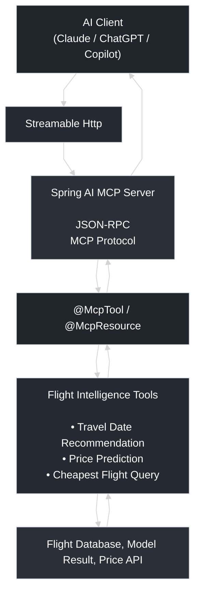

## Flight Price Intelligence MCP
Let's design a flight price intelligence with price prediction tool, date recommendation tool and cheapest flight query. The whole point is to let LLM agent answer "what is the cheapest weekend flight in August from LAX to NYC?"

### Why MCP?
You may ask why not REST? REST defines a business API call. MCP could have REST to communicate with internal data. But MCP adds AI-oriented capable to discovery, tools/resources and lifecycle.

It delivers a structured flight price and date recommendation capabilities to multi AI agent rather than build custom integration for each client.

### Why Spring AI + Streamable HTTP?
- Spring AI ship standard MCP server on Spring without hand-rolling protocol plumbing. Spring AI implement protocol for us, we only define business capacity using annotations @McpTool, @McpResource, @McpPrompt

- Streamable HTTP provides a standard HTTP endpoint (POST /mcp) while supporting both simple request/response interactions and streaming progress update over the same connection. The streaming one is a typical LLM communication method that client get updates all the time with info and progress.

### How to guarantee MCP safety?
NEVER let LLM access database directly. LLM output is an injection vector which could create data leak, uncontrolled query, cost and stability risk.

We could create a protection layer such as use jOOQ -- it use schema-aware meta-lookups and reject anything non-select at execution. You could also provide classified rejctions with customized reason.

The different between jOOQ and Hibernate is another interesting topic:
- Hibernate is ORM focusing on mapping database fields to java objects. It hides SQL which could cause performance issue with complex query.
- jOOQ is SQL-first focusing on relational data and explicit control over SQL. It does not hide SQL. Simply wraps it in a typesafe java compiler shield.