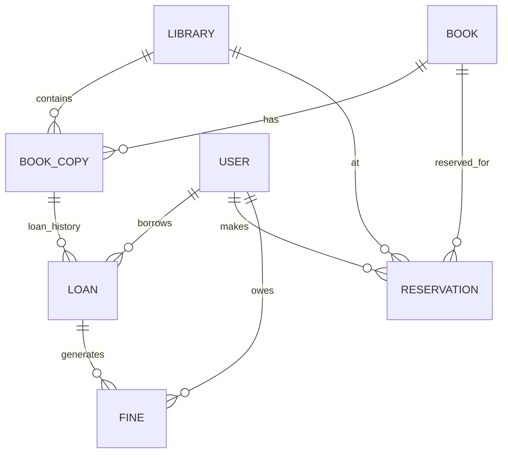

# Library Management System
* Support multiple libraries under one system
* Users should be able to borrow, reserve and return books
* Librarians can add/remove books and manage user fines

Design most important tables, fields and relationships

## Analysis
a. What are the nouns? Library, User, Librarian, Book, BookCopy, Loan, Reservation, Fine

b. What are the relationships? how each object connects to another

Library owns BookCopies; User creates Loans; User creates Reservations; Loan may generate Fines

c. What is 1:N / N:N? Determine cardinality

Library→BookCopy = 1:N; 
Book→BookCopy = 1:N; 
User→Loan = 1:N; 
User↔Book = N:N through Loan

d. Which data has lifecycle/history? what changes over time and should not simply be overwritten

Loan, Reservation, Fine, BookCopy status

e. What requires atomicity? what multiple DB operations must succeed/fail together

Borrow, Return, Reservation assignment, Fine payment

## Entity Relationship Diagram


## Solution
When it comes to individual table, always run: Entity → ID → relationship/FK → business attributes → lifecycle/status → timestamps

### Book
| Column      | Type | Constraint | Description            |
|-------------|---|------------|------------------------|
| `book_id`   | UUID | PK         | Unique book identifier |
| `title`     | VARCHAR | NOT NULL   | book name              |
| `ISBN`      | VARCHAR | UNIQUE     | book info              |
| `publisher` | VARCHAR |      | book info              |

**Relationship:** One Book has many BookCopies.

### BookCopy
| Column    | Type    | Constraint | Description                     |
|-----------|---------|------------|---------------------------------|
| `copy_id` | UUID    | PK         | Unique bookCopy identifier      |
| `book_id` | UUID    | FK         | book ref                        |
| `lib_id`  | UUID    | FK         | lib ref                         |
| `status`  | VARCHAR | NOT NULL   | BORROWED,DEMAGED,LOST,AVAILABLE |

**Relationship:** Many bookCopy to Many lib.

### Library
| Column | Type | Constraint | Description |
|---|---|---|---|
| `lib_id` | UUID | PK | Unique library identifier |
| `name` | VARCHAR | NOT NULL | Library name |
| `address` | VARCHAR | | Physical location |

**Relationship:** One Library has many BookCopies.

### User
| Column    | Type | Constraint | Description            |
|-----------|---|---|------------------------|
| `user_id` | UUID | PK | Unique user identifier |
| `name`    | VARCHAR | NOT NULL | user name              |
| `address` | VARCHAR | | user info              |
| `email`   | VARCHAR | | user info              |
| `phone`   | VARCHAR | | user info              |

**Relationship:** 1 user many load, reservation, fine.

### Loan
| Column        | Type      | Constraint | Description                |
|---------------|-----------|------------|----------------------------|
| `loan_id`     | UUID      | PK         | Unique load identifier     |
| `copy_id`     | UUID      | FK         | book ref                   |
| `user_id`     | UUID      | FK         | user ref                   |
| `status`      | VARCHAR   | NOT NULL   | BORROWED,RETURNED, OVERDUE |
| `return_date` | TIMESTAMP | NOT NULL           |                            |
| `borrow_date` | TIMESTAMP   | NOT NULL           |                            |
| `due_date`    | TIMESTAMP   | NOT NULL           |                            |


**Relationship:** 1 load 1 copy, many loan 1 user.

### Reservation
| Column      | Type | Constraint | Description                                                       |
|-------------|---|------------|-------------------------------------------------------------------|
| `reserv_id` | UUID | PK         | Unique reserve identifier                                         |
| `copy_id`   | UUID | FK         | book ref, could be book_id depends on reserve a title or physical |
| `user_id`   | UUID | FK         | user ref                                                          |
| `status`    | VARCHAR   | NOT NULL   | WAIT,COMPLETE,EXPIRE                                              |
| `create_at` | TIMESTAMP | NOT NULL   |                                                                   |
| `expire_at` | TIMESTAMP | NOT NULL   |                                                                   |

**Relationship:** 1 user N reservation, 1 book N reservation.

### Fine
| Column      | Type    | Constraint | Description          |
|-------------|---------|------------|----------------------|
| `fine_id`   | UUID    | PK         | Unique fine identifier |
| `load_id`   | UUID | FK         | load ref             |
| `user_id`   | UUID | FK         | user ref             |
| `reason`    | VARCHAR | NOT NULL   | OVERDUE, LOST, DAMAGED          |
| `status`    | VARCHAR | NOT NULL   | UNPAID, PAID, WAIVED      |
| `amount`    | INT     | NOT NULL   |                      |
| `create_at` | TIMESTAMP | NOT NULL   |           |
| `paid_at`   | TIMESTAMP | NOT NULL   |           |

**Relationship:** 1 user N fine, 1 book N fine, 1 reservation N fine.

## 5. Transaction

Borrowing must be atomic:

```sql
BEGIN;

UPDATE book_copy
SET status = 'BORROWED'
WHERE copy_id = :copy_id
  AND status = 'AVAILABLE';

-- Continue only if exactly one row was updated.

INSERT INTO loan (
    user_id,
    copy_id,
    borrowed_at,
    due_at,
    status
)
VALUES (
    :user_id,
    :copy_id,
    NOW(),
    :due_at,
    'BORROWED'
);

COMMIT;
```

This prevents two users from successfully borrowing the same physical copy.


